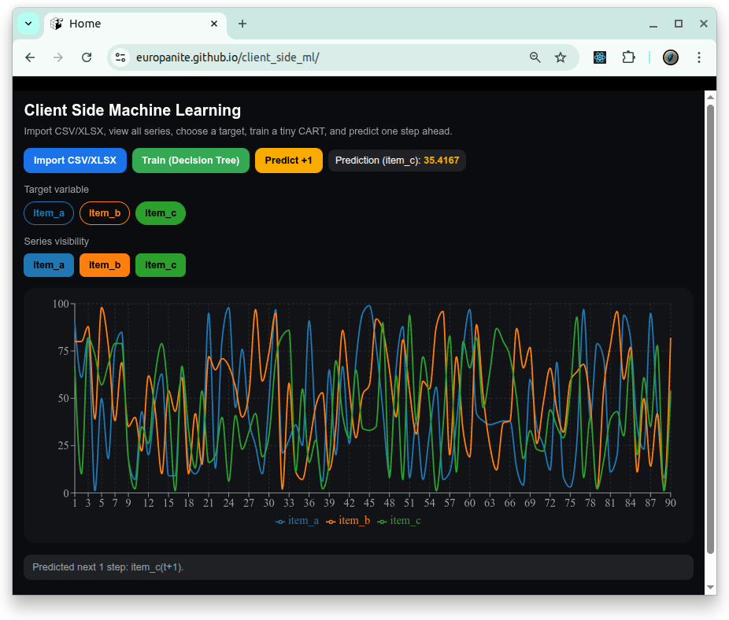

# [Client Side Machine Learning](https://github.com/europanite/client_side_ml "Client Side Machine Learning")

A Client-Side Machine Learning Playground. 



##  🚀 PlayGround

 [Client-Side Machine Learning ](https://europanite.github.io/client_side_ml/)

Import **CSV/XLSX** in the browser, visualize **all series**, pick a **target**, train a **decision-tree (CART) regressor**, then **predict the next 1 point** 

---

## Data Structure

<pre>
datetime,item_a,item_b,item_c,...
2025-01-01 00:00:00+09:00,10,20,31,...
2025-01-02 00:00:00+09:00,12,19,31,...
2025-01-03 00:00:00+09:00,14,18,33,...
 ...
</pre>

---

## ✨ Features

- **One-click import** of `.csv`, `.xlsx` (first sheet is used)
- **Auto schema detection**: finds datetime column and numeric columns
- **Full multi-series chart** with **color-coded lines & toggles**
- **Target chooser** (color chips) → **Train** (CART) → **Predict +1**
- **Pure client-side**: no backend required

---

## 🖼️ Data & Charting

- **CSV format**: header row + rows of values. If a column is named `datetime` / `date` / `time`, it will be used as X-axis labels. Numeric columns are auto-detected and plotted.
- **XLSX**: the first sheet is parsed via **SheetJS** on web.

---

## 🧠 Model (CART regressor)

- Pure TypeScript implementation (no native bindings)
- Greedy binary splits on quantile candidates
- Defaults: `maxDepth=4`, `minLeaf=8`
- Train button builds the tree on filtered numeric rows; **Predict +1** uses the **last row’s feature vector** to estimate the next target value.

---

## 🚀 Getting Started

### 1. Prerequisites
- [Docker](https://www.docker.com/) & [Docker Compose](https://docs.docker.com/compose/)

### 2. Build and start all services:

```bash
# set environment variables:
export REACT_NATIVE_PACKAGER_HOSTNAME=${YOUR_HOST}

# Build the image
docker compose build

# Run the container
docker compose up
```

### 3. Test:
```bash
docker compose \ 
  -f docker-compose.test.yml up \ 
  --build --exit-code-from \ 
  frontend_test
```

---

## 📜 License
- Apache License 2.0